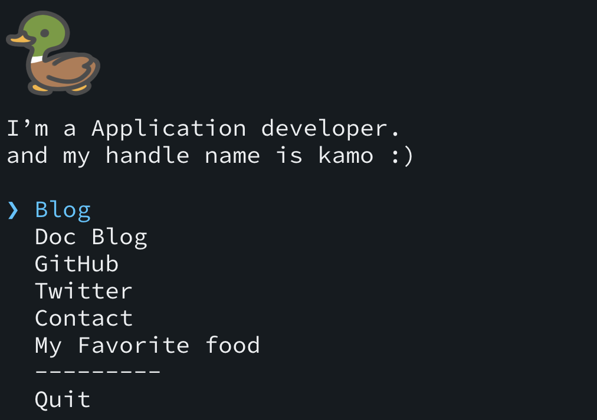

# cli-app-sample
> use to introduce yourself with CLI



# Usage

使用する上で、以下の設定をする必要がある

## リポジトリ生成
自分のアカウント名と同じ名前のリポジトリを作成する<br>
※大文字が入っている場合は小文字に変えて作成

このリポジトリをローカルにクローンしてリモート先は自分のアカウント名のリポジトリに設定する

## 修正箇所

### `package.json`
以下を参考に変更する
```json
{
  ︙
  "name": "自分のリポジトリ名を指定",
  ︙
  "description": "自分のリポジトリ名 CLI",
  ︙
  "repository": {
    "type": "git",
    "url": "git+https://github.com/アカウント名/リポジトリ名.git"
  },
  "keywords": [
    "cli-app",
    "cli",
    "自分のリポジトリ名"
  ],
  "author": {
    "name": "公開する名前",
    "email": "メールアドレス"
  },
  ︙
  "bin": {
    "リポジトリ名": "./src/cli.js"
  },
  ︙
}

```

### `src/const.js`
```javascript
︙
exports.userName = 'リポジトリ名'
︙
exports.introduce = '自己紹介文'
︙
exports.userItems = [
  {
    label: 'CLIで表示させたい名前',
    url: 'URLアドレス'
  },
  ︙
]
︙
```

### `src/avatar.png`
表示させたいアイコンに変更する<br>
※アイコン名を変えた場合、 `src.const.js` の `imgFileName` にも修正をする

### `README.md`
設定が終わったら、他に紹介したいものをこちらの `README.md` に記載する

## `npm`にデプロイ
大まかな流れは以下の通り

1. [npmjs](https://www.npmjs.com/)でユーザ登録する
2. 登録した情報を元にローカル環境から `npm` にユーザを追加する
3. `npm publish .` でデプロイをする

デプロイが完了すると以下のコマンドで確認ができる
```zsh
npx リポジトリ名
```

# Command
ローカルで確認するときは以下のコマンドで確認する
```zsh
npm run build
```

# License
<a href="https://leeddhh.github.io"></a>

MIT © [leeddhh](https://leeddhh.github.io)
